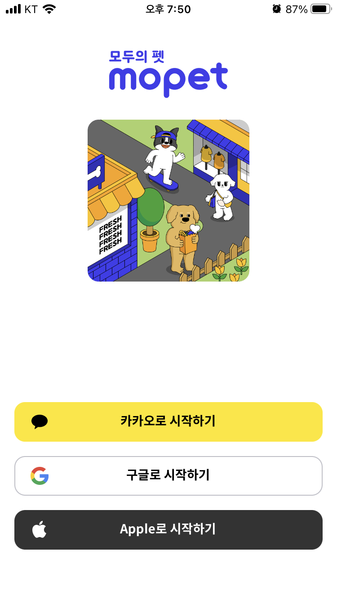
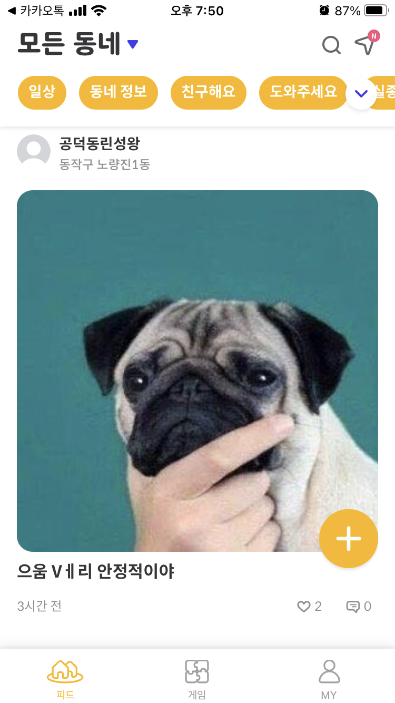
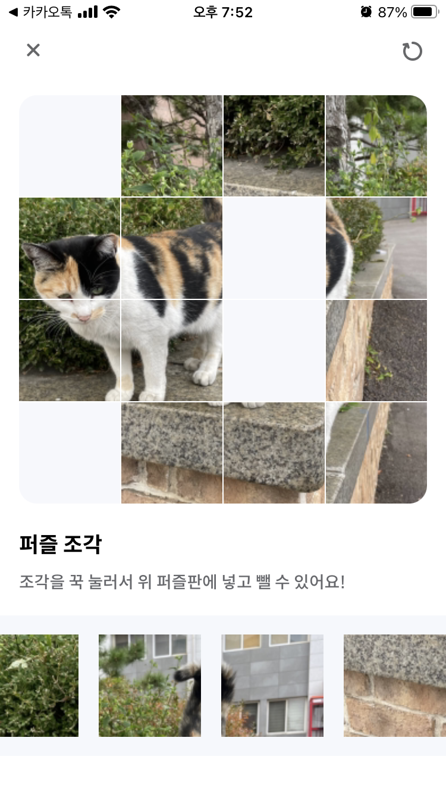

# 모두의 펫

> 반려동물 라이프스타일 SNS

 

## 1. 개요

---

### 1) 개발 기간

- 2022년 7월 ~ 2022년 11월 (4개월)

### 2) 참여 인원

- PM (1명)
- iOS 개발 (2명)
- 안드로이드 개발 (1명)
- 서버 개발 (1명, 본인)

### 3) 협업 도구

- 슬랙 (개발자, PM간 의사소통)
- 구글 스프레드시트 (고객사 QC, 스케쥴 관리)
- 제플린 (UI/UX 디자인)

## 2. 사용 기술

---

### 1) 인프라

- AWS EC2 (t3.medium)
- AWS S3 (이미지 저장용)
- AWS RDS (MySQL v8.0.31)

### 2) 개발 도구

- Javascript
- Node.js 런타임
- Express 프레임워크
- Redis
- Bull (MQ)
- Cron
- Multer (Multer-S3)

### 3) 외부 API

- 알리고 API (SMS 서비스)
- 톡플러스 API (채팅 서비스)
- 카카오맵 API (지도 서비스)

### 4) 형상 관리

- git
- gitlab (원격 저장소)

### 5) CI/CD

- gitlab runner

## 3. 핵심 기능

---

- REST API 서버 구축
- 당근마켓과 같이 지역 설정으로 피드 게시글 조회
- 반려동물 사진을 이용한 퍼즐 맞추기 게임

## 4. 트러블 슈팅

---

### 1) 피드 게시글 페이징

- 무한 스크롤을 구현해야하므로 MySQL의 Offset으로는 한계가 있음
- 커스텀 커서를 만들어 커서 기반 페이지네이션으로 구현

### 2) 알람봇 설정

- 특정 시간 혹은 반복 시간마다 동작하는 알람봇 (관리자 메세지)
- API가 호출되지 않아도 동작해야 하므로 Cron 모듈을 사용하여 특정 시간에 동작하도록 설정

### 3) Socket hang up 에러

- 톡플러스 API와 통신 중 소켓 통신 에러 발생
- Node.js 타임아웃을 무한대로 설정해도 같은 에러 발생
- Bull 라이브러리를 사용하여 메세지 큐를 생성. 톡플러스 API와 통신이 필요한 작업이 발생할 때마다 큐에 작업을 넣고 실행

### 4) 번호 인증값 저장

- DB에 매번 저장하고 읽어오는데 리소스 낭비
- In-Memory DB인 Redis를 이용하여 세션 스토리지 구축
- 데이터의 유효시간을 설정하여 특정 시간 후 자동삭제 기능 추가

### 5) 동네 설정

- 모든 동네 정보를 DB에 저장할 수 없음
- 카카오맵 API를 이용하여 좌표값을 행정동으로 변환. 이후 해당 정보를 동네 DB에 저장